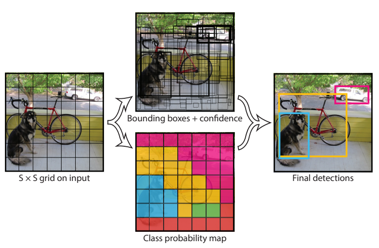
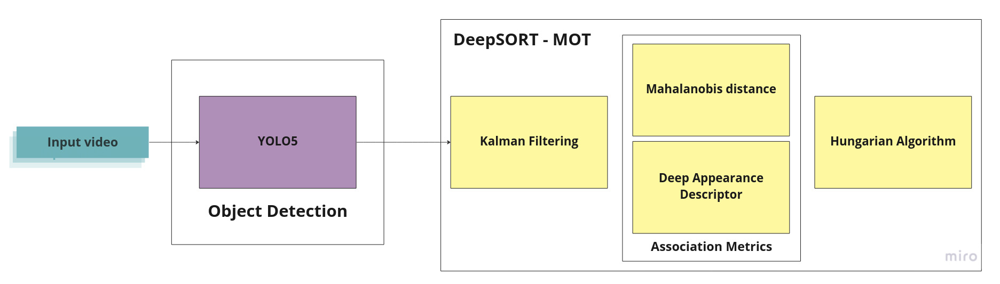
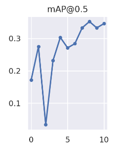

# MULTI-OBJECT TRACKING ON SOCCER VIDEOS

## Authors: 
Jakob Fahl, Xindi Wu, Kristoffer Nielsen, Thomas Spyrou
           
## Project Description

### Overview
This repository is dedicated to building a comprehensive real-time soccer videos tracking system with video resources supplied by VEO Technologies. This project combines the YOLO object detection algorithm and the DeepSORT trakcer, aiming to implememnt a real-time object tracking pipeline to track players's movement in the soccer matches, which serve a crucial step for collecting player and team performance data. The SoccerNet dataset and soccer videos from VEO Technologies were used to model train and evaluation. 
               
### Methodology
#### YOLO
               
You Only Look Once (YOLO) is an approach for object tracking. It
frames object detection as a regression problem analyzing pixels of an
image and uses convolutional neural networks to predict spatially
separated bounding boxes and the associated class probabilities. With
video streaming, it directly optimizes detection performance on all full
images through the video.
               
An example architecture of YOLOv1 is shown in figure
below. It has 24 convolutional layers followed
by 2 fully connected layers. The convolutional layers of the neural
network extract feature from the image, while the fully connected layers
predict the output probabilities as well as the coordinates of the
object. This network uses features from the entire image to
simultaneously predict all bounding boxes across all classes. It enables
end-to-end training and real-time speeds while maintaining high average
precision.
              

                      
YOLO divides the input image into an $S \cdot S$ grid, shown in figure
below. Each grid
cell is responsible for predicting bounding boxes of objects whose
center falls onto the cell. The bounding box consists of six
predictions: $x$, $y$, $w$, $h$, confidence and conditional class
probability. The $(x,y)$ coordinates represent the center of the box in
the grid cell. The width and height are predicted relative to the whole
image, represented by w and h. The confidence is defined as
$Pr(Object) * IOU$ (the intersection over the union between the
predicted box and the ground truth), reflecting how confident the model
is that the box contains an object and how accurate it thinks the box is
that it predicts. One set of conditional class probabilities is
predicted per cell, denoted as $Pr(Class_i|Object)$. Thus, multiplying
the conditional class probabilities and the individual box confidence
would give us class-specific confidence scores for each box,
 $$
 Pr(Class_i|Object) * Pr(Object) * IOU^{truth}_{pred} = Pr(Class_i) * IOU^{truth}_{pred}
 $$ indicating the probability of that class appearing in
the box and how well the predicted box fits the object.
             
With the first version introduced in 2015, subsequent versions
are coming out as YOLOv2, YOLOv3, YOLOv4, YOLOv5, YOLOv6, YOLOv7, etc.,
as well as revised-limited versions, such as YOLO-LITE. The YOLO models
have been constantly improving its speed and accuracy. According to
tests by Wang and his colleagues, YOLOv7 surpasses all
known object detectors in both speed and accuracy in the range from 5
FPS to 160 FPS and has the highest accuracy 56.8% AP among all known
real-time object detectors with 30 FPS or higher on GPU V100. This gives
us a good reason to apply YOLOv7 for object detection in our project.
                 

#### DeepSORT
 
DeepSort is a tracking-by-detection algorithm, which gets
the detection from the YOLO-model, and DeepSORT uses them to track
objects. The YOLO-model outputs bounding boxes and their parameters as
well as confidence, which DeepSORT in association with an appearance
feature of the tracked object uses for tracking. With the bounding boxes
and the appearance vector from the previous and current frame, DeepSORT
associates the object in the current frame to tracked objects from
previous frames. This algorithm then only uses the previous frame and
the current frame in order to track the objects, which allows the model
to have fast inference and not storing much data.
            
The tracking starts with each object in the first frame being assigned
an ID, if the confidence is higher than a given threshold. To assign the
players for future frames the assignment problem must be solved.
Assigning the new frames to the tracks from previous frames is done by
using the Hungarian algorithm. The Hungarian algorithm tries to minimize
the cost function.
                 
The cost function consists of two distance measures, which is based on
the position of the bounding boxes and the appearance vector. The
position is measured with the Mahalanobis distance, where the distance
is between the predicted position and the actual position of the current
frame. The predicted position uses a Kalman filter, which predicts the
placement of bounding boxes using information from previous frames. The
information is a eight-dimensional space with the center of the bounding
box $(u,y)$, the height and width of the bounding box $(\gamma,h)$, and
the velocity of the bounding box. The Kalman filter then predicts a
location of the bounding box in the next frame, and computes the
Mahalanobis distance based on this. The Mahalanobis distance is
calculated the following way:
$$d_1(i,j)=(d_y-y_i)^T S_i^{-1} (d_j-y_i)$$
                      
The second distance is the cosine distance based on the appearance
vector. The distance is measured by measuring the similarity of the
track *i* and the *j*-th detection in the appearance space. It is used
to select the track, which the object in a bounding box is most similar
to, and thereby associates the object with that track. The cosine
distance is measured by:
$$d_2(i,j)= \min \{ 1-r^T_j r_k^{(i)}|r_k^{(i)} \in R_i \}$$ where $R_i$
is the last 100 appearances descriptors for each track *k*. With the
mahalanobis distance and the cosine distance, the cost function can be
computed by: $$c=\lambda\cdot d_1(i,j)+(1-\lambda) \cdot d_2(i,j)$$
                 
The appearance features is found by using a convolutional neural network
consisting of two convolutional layers, 6 residual blocks, and dense
layer, which outputs a 128-element vector. The appearance vector is what
differentiates DeepSORT from the SORT (Simple Online Realtime Tracking)
model, because of the convolutional neural network. The appearance
vector helps to re-identify objects when occlusion happens or objects
leave the frame.
                  

                  
The Mahalanobis distance is mostly used for the short-term predictions,
because it uses the motion of the objects. Appearance features are in
contrasts useful for long-term occlusions, because it helps recover
identities when lost for a short period. The two distances is therefore
complimenting each other. If an object in the frame is not able to be
assigned to a track, either by being a new object or the model cannot
assign it to a previous track, a new ID is generated. Objects not
assigned to a track is because of the thresholds set on $d_1$ and $d_2$,
where the object distances are higher than the threshold in the model.
Tracks not having objects assigned to them will be terminated after a
number of consecutive frames, where the number of frames are a parameter
set in the model. Objects belonging to that track will be given a new
ID, when entering the image or being detected again.

### Results
For players, the model detect and classify them with accuracy 71%, in other cases they are predicted as background. In contrast, the ball and the goalkeepers are the hardest to predict, with the former being ignored and the latter usually classfied as players.  
    
The mean average precision(mPA) as a key evaluation metric of the performance of object detection, is shown in figure below. It measures the average precision of the model across a range of intersection over Union thresholds.     

                  
The drop of the mAP at zero in the third epoch could be a result of not diverse data, considering the SoccerNet dataset despite the amount of the data the background and the jerseys of the teams remain the same. Moreover, other factors can  cause the drop such as the learning rate or overfitting, which was noticed in some of the training runs with the training box loss to be reduced quite soon, but in the validation phase that was not the case.

### What data do we use to run on?
We use [ImageNet 1000 (mini)](https://www.kaggle.com/datasets/ifigotin/imagenetmini-1000). It includes 1000 classes. It is a more compressed version of the ImageNet dataset and contains 38.7k images. The ImageNet dataset is used widely for classification challenges and is useful t
